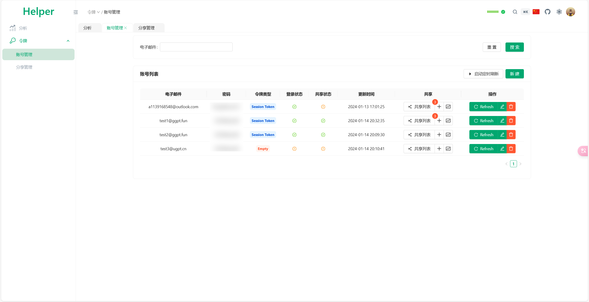
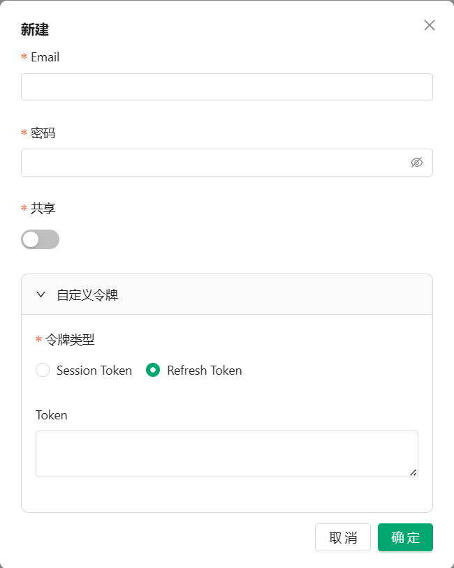
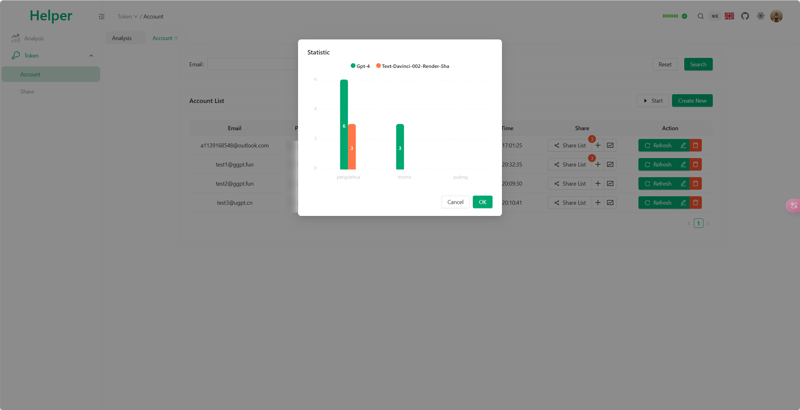
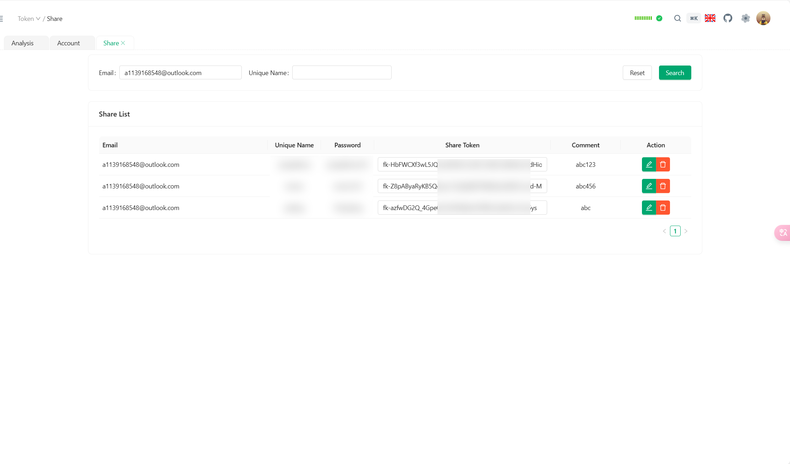

# Pandora Helper

  
## 简单介绍
* **使用Web页面管理你Pandora的所有Token！**
* **你无需了解各种Token如何获取、转换、刷新，Helper帮你处理了这一切！**
* 支持添加 `账号\密码` ，一键获取`Access Token`和`Session Token`
* 自动使用 `Session Token` 续期，节省Pandora额度！
* 管理账号下的所有`Share Token`。支持一键刷新所有`Share Token`、吊销指定`Share Token`。
* 一键启动定时器，自动检测Token失效后刷新`Access Token`和`Share Token`！
* 在以上操作完成后，会自动更新`config.json`文件，并调用`reload` Api，直接生效 ！
* 本项目保持低侵入性，不参与管理PandoraNext程序。只是方便刷新、管理账号和各种Token。
  
  
  
  

## 写在最后
- 特别鸣谢: [PandoraNext](https://github.com/pandora-next/deploy)
- 本项目前端基于 [Slash-Admin](https://github.com/d3george/slash-admin)
  感谢各位大佬的付出
- [https://t.me/ja_netfilter_group/458502](https://t.me/ja_netfilter_group/458502)
## Star History

