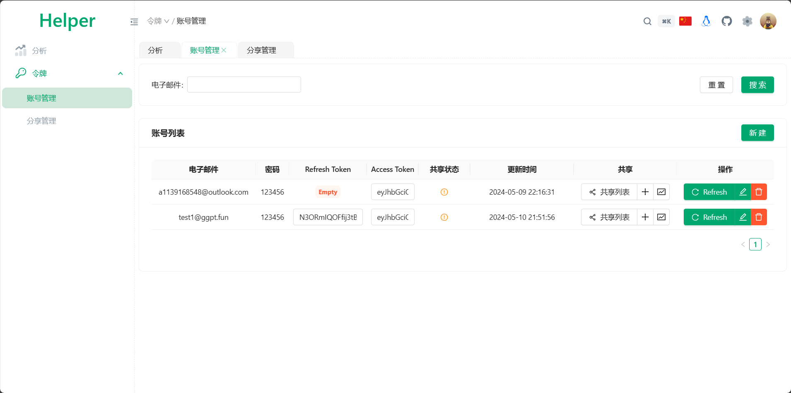
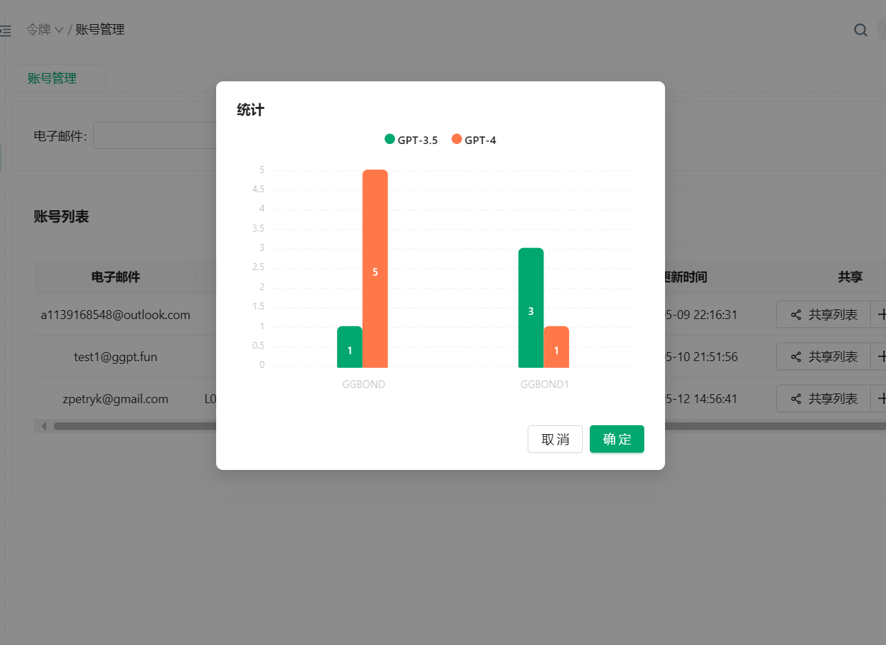
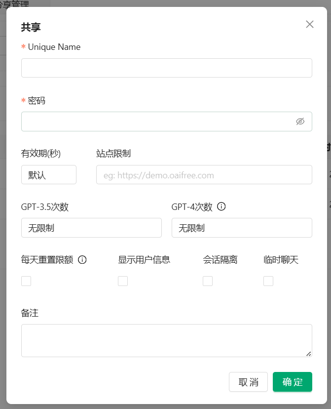
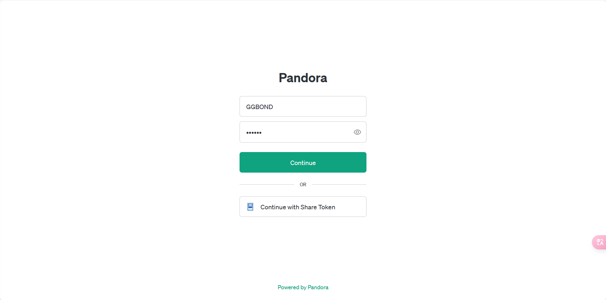

# Pandora Helper


本项目是基于oaifree和fuclaude实现的，感谢LinuxDo，可以在LinuxDo中联系我：[linux](https://linux.do/u/linux/summary)
## Pandora Car
我在本项目的基础上，开发了Pandora Car项目，这是一个公益项目，你可以理解为托管式的PandoraHelper
目的是让不会部署或者没有VPS的小伙伴，也可以0门槛开GPT Plus车！  
地址：https://www.oai2b.com  
详细介绍：https://linux.do/t/topic/118652  
## 简单介绍
- **账号管理**: 集中管理ChatGPT和Claude账号。
- **分享账号**: 轻松创建和管理共享账号, 与其他小伙伴共享ChatGPT Plus/Claude Pro服务。
- **分享功能**：支持各分享账号的会话记录隔离、模型次数限制、有限期限制、道德审查限制等
- **用户界面**: 同步的ChatGPT/Claude官方Web UI页面，1:1还原。
- **使用统计**: 追踪共享账号的使用情况,包括各模型的使用量、对话记录等。
- **自动刷新**: 支持自动刷新账号令牌,确保长期可用性。
  
## 手动部署

* 在[Releases](https://github.com/nianhua99/PandoraHelper/releases)中下载对应操作系统和架构的包。
* 解压后修改同目录中的`config.json`至你需要的参数。
* 你必须设置一个8位以上的**admin_password**，它是你后台管理的登录密码！
* 各种Linux/Unix系统使用`./PandoraHelper`启动即可。
* Windows系统双击`PandoraHelper.exe`即可，当然需要在cmd中启动。

## Docker部署
```bash
docker pull q11391/pandora-helper
docker run -d --name PandoraHelper --net=bridge \
      -p 9000:9000 \
      -v ./data:/app/data \
      q11391/pandora-helper
```
- 容器内使用9000端口，你可以映射到其他端口。
- `config.json`会保存在`./data`目录下, 修改其中的 **admin_password** 后再启动Docker。
- 第一次启动容器时, 会自动生成`data.db`文件。
## Docker Compose部署
- 创建或拉取`config.json`配置文件到`./data`目录下。并修改其中的 **admin_password**。
- 创建`docker-compose.yml`文件，内容如下：
- `docker-compose up -d`**原神, 启动！**。
```yaml
version: '3'

services:
  pandora-next:
    image: q11391/pandora-helper
    container_name: PandoraHelper
    network_mode: bridge
    restart: always
    ports:
      - "9000:9000"
    volumes:
      - ./data:/app/data
```

## k8s部署
- 修改`deploy/k8s/deploy.yaml`中的`pvc`部分至你需要的参数。
- 修改`deploy/k8s/deploy.yaml`中的`config.json`部分至你需要的参数。
- 在k8s中部署
```bash
kubectl apply -f deploy/k8s/deploy.yaml
```

## 配置文件
* **admin_password**：后台管理登录密码，**没有默认值，必须设置**。环境变量为：`ADMIN_PASSWORD`
* 有关Pandora.domain下的设置, 如果你反代了`new.oaifree.com`则需要修改为你反代后的域名。
* 所有配置项均可通过环境变量来设置，比如`http.host`可以写作`HTTP_HOST`
```json
{
  "security": {
    "admin_password": ""
  },
  "http": {
    "host": "0.0.0.0",
    "port": 9000,
    "title": "Pandora",
    "rate": 100
  },
  "database": {
    "driver": "sqlite",
    "dsn": "./data/data.db"
  },
  "share": {
    "random": true,
    "custom": true
  },
  "pandora": {
    "domain": {
      "chat": "https://chat.oaifree.com",
      "token": "https://token.oaifree.com",
      "index": "https://new.oaifree.com",
      "claude": "https://demo.fuclaude.com"
    }
  },
  "log": {
    "level": "info",
    "encoding": "console",
    "output": "console",
    "log_file_name": "./logs/server.log",
    "max_backups": 30,
    "max_age": 7,
    "max_size": 1024,
    "compress": true
  }
}
```
## 使用说明
* 管理员登录：访问`/admin`页面，输入`admin_password`即可登录。
* 普通用户登录：访问`首页`或`/login`页面，输入`Unique Name`和`密码`即可登录。
### 账号管理
* **账号管理**：在`账号管理`中可以查看所有账号的`Refresh Token`、`Access Token`、`Email`。
* **刷新Token**：在`账号管理`中点击`刷新`可以刷新`Access Token`。**只有你填入了`Refresh Token`才能使用此功能**。程序会在每日凌晨自动刷新。
* **添加账号**：在`账号管理`中点击`新建`，输入`Refresh Token`或`Access Token`，以及`Email`点击`保存`。请注意，这里的`密码`没有实际作用。
* **用量统计**：统计本账号下各个`Share Token`的用量情况。
* 
* 
### 生成共享账号
在`账号管理`中可以生成`Share Token`。点击`共享`列的 + 号，输入`Email`和`限额`等信息。点击`保存`即可生成`Share Token`。
- Unique Name / 密码: 你的伙伴将在本系统的 /login 页面使用Unique Name和这个密码登录。
- 有效期：到期后共享账号将被自动删除。
- 站点限制：共享账号只能在这些站点使用。
- GPT3.5/GPT4次数：这是共享账号的GPT3.5/GPT4次数限制（所有时间内）。
- **每天重置限额**：勾选后，每天凌晨将重置限额。这样你可以限制这个共享账号每天的使用次数。
- 显示用户信息：勾选后，共享账号会看到主账号的Email。
- 会话隔离：建议开启
- 临时聊天：开启后共享账号不会留下聊天记录。

### 分享管理
* **分享管理**：在`分享管理`中可以查看所有`Share Token`的各种信息。你可以在这里直接使用`Share Token`发起对话。

### 分享登录
本系统使用原生的Pandora登录页面，你可以在`/login`页面使用`Unique Name`和`密码`登录。

## 写在最后
- 特别鸣谢: [LinuxDo](https://linux.do/)
- 本项目前端基于 [Slash-Admin](https://github.com/d3george/slash-admin)
- 本项目后端基于 [go-nunu](https://github.com/go-nunu/nunu)
## Star History

[](https://star-history.com/#nianhua99/PandoraNext-Helper&Date)
