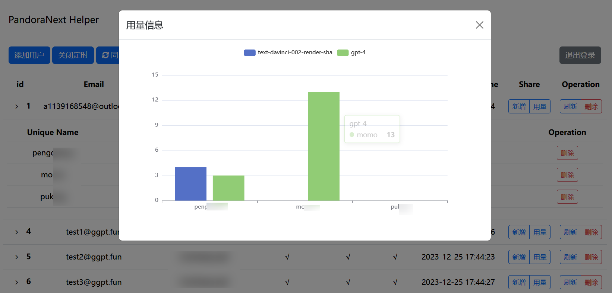

# PandoraNext Helper  


  
~~GPT-4和Copilot帮助完成了本项目90%的代码~~
## 简单介绍
* **使用Web页面管理你PandoraNext的所有Token！**
* **你无需了解各种Token如何获取、转换、刷新，Helper帮你处理了这一切！**
* 支持添加 `账号\密码` ，一键获取`Access Token`和`Session Token`
* 自动使用 `Session Token` 续期，节省Pandora额度！
* 管理账号下的所有`Share Token`。支持一键刷新所有`Share Token`、吊销指定`Share Token`。
* 一键启动定时器，自动检测Token失效后刷新`Access Token`和`Share Token`！
* 在以上操作完成后，会自动更新`config.json`文件，并调用`reload` Api，直接生效 ！
* 本项目保持低侵入性，不参与管理PandoraNext程序。只是方便刷新、管理账号和各种Token。


## Docker部署
```shell
$ docker pull q11391/pandora-next-helper
$ docker run -d --restart=always --name PandoraNext-Helper --net=bridge \
    -p 8182:8182 \
    -v <YOUR_PANDORA_NEXT_PATH>:/data \
    -e PANDORA_NEXT_DOMAIN="<YOUR_PANDORA_NEXT_DOMAIN>" \
    q11391/pandora-next-helper
```
* 请替换`<YOUR_PANDORA_NEXT_PATH>`为你的PandoraNext路径, 如`/opt/pandora-next`, 请确保PandoraNext的`config.json`文件在此目录下。
* 请替换`<YOUR_PANDORA_NEXT_DOMAIN>`为你的PandoraNext域名, 如`https://www.baidu.com`，没有域名的话也可以使用IP，比如http://192.168.1.1:8181 这样，只能要访问到你的PandoraNext即可
* **请访问`IP:8182/<PROXY_API_PREFIX>/login`进行使用！**
## 原生Python部署(Python3)
```shell
$ git clone https://github.com/nianhua99/PandoraNext-Helper.git
$ pip3 install -r requirements.txt
# 修改以下域名为你PandoraNext的域名
$ export PANDORA_NEXT_DOMAIN=https://www.baidu.com
# 修改以下路径为你本机PandoraNext的路径，确保路径中包含config.json
$ export PANDORA_NEXT_PATH=/path/to/pandora
# 数据库初始化
$ flask db upgrade
# 启动
$ python3 waitress_run.py
# 或者在后台启动
$ nohup python3 waitress_run.py &
```
**请访问`IP:8182/<PROXY_API_PREFIX>/login`进行使用！**
## 如何借助本项目管理共享ChatGPT车？
首先需要搭建完成PandoraNext项目，以及本项目  
在Helper中，添加你的OpenAI账号 -> 点击刷新（获取登录凭证） -> 点击Share列的添加按钮 -> 定义乘客登录时需要的账号密码  
将乘客的账号密码（也叫UniqueName、Password）发送给乘客  
至此，即完成了分享，每个乘客之间互相屏蔽，你也可以随时吊销乘客
## 注意事项
* 本项目复用了PandoraNext的`config.json`文件，包括`setup_password`|`captcha`|`proxy_api_prefix`
* 项目依赖两个环境变量
  * `PANDORA_NEXT_PATH`: 指向PandoraNext的路径，如`/opt/pandora-next`
  * `PANDORA_NEXT_DOMAIN`: 你的PandoraNext域名，如`https://www.baidu.com`
* 目前验证码只支持`hcaptcha`，你可以在这里获得 hcaptcha ：https://www.hcaptcha.com
* 以上配置全部是**必选**，否则无法使用本项目
* 项目会在你的`YOUR_PANDORA_NEXT_PATH`中生成`helper.db`文件，用于存储Token信息
## 其他说明
> [!CAUTION]
> 如果你实在不想开启**验证码**  
> 项目本身不提供开关，这道门槛可以让小白也注意到安全问题。  
> ~~如果你确保你的网络环境安全，你可以尝试使用 hcaptcha 提供的测试Key，它将直接Pass，无需你打码~~
> ```json
"captcha": {
		"provider": "hcaptcha",
		"site_key": "10000000-ffff-ffff-ffff-000000000001",
		"site_secret": "0x0000000000000000000000000000000000000000",
		// 其他配置
}
```
## Todo
- [x] 展示Pandora额度信息
- [x] 生成指定账号下各Share Token的用量情况柱状图
- [x] 支持预置Token、Refresh Token
- [ ] Русская адаптация
- [ ] 支持管理Pool Token
- [ ] 支持编辑
- [ ] 支持更多PandoraNext配置
- [ ] 支持更多验证码
- [x] ~~代码优化~~
## Star History

[](https://star-history.com/#nianhua99/PandoraNext-Helper&Date)
